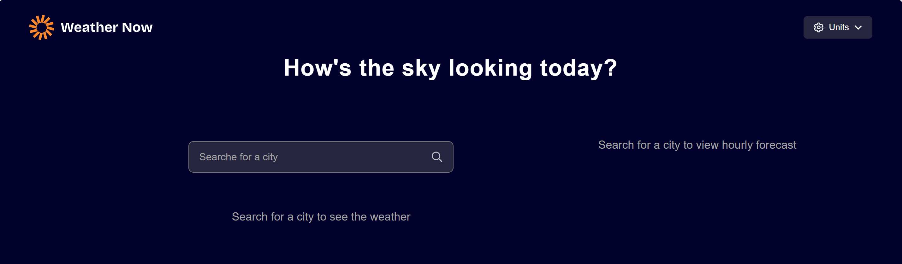
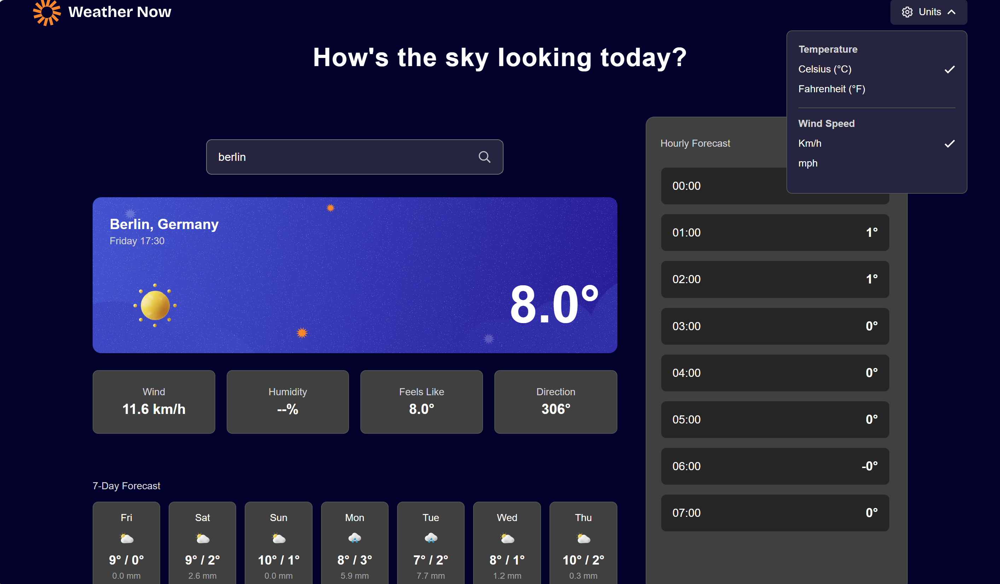
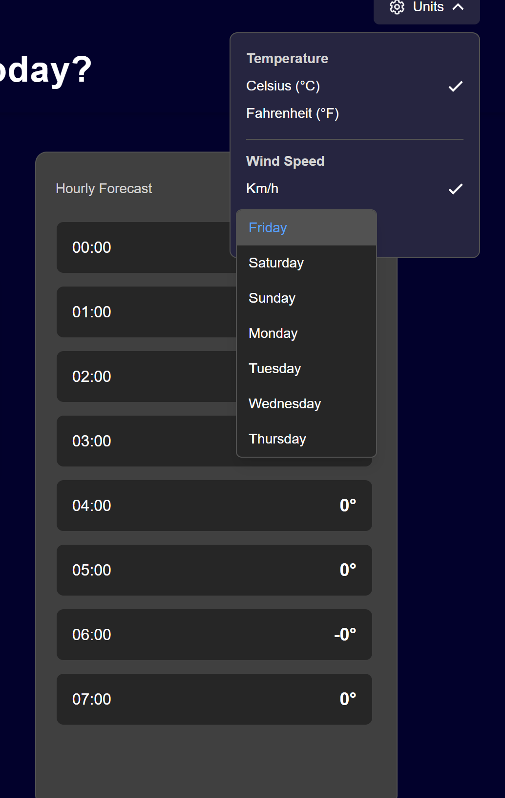

# 🌤 Weather App

A modern weather application built with **React** that allows users to search for cities and view real-time weather data, including current conditions, hourly forecast, and 7-day forecast.

---

## 🚀 Features

- 🔍 Search for any city worldwide
- 🌡 View current weather conditions
- 🕒 Hourly forecast
- 📅 7-day forecast
- 🔄 Temperature unit switch (°C / °F)
- 💨 Wind speed unit switch
- ⚡ Loading state handling
- ❌ Error handling for invalid searches
- 🧠 Global state management using React Context
- 📱 Responsive design

---

## 🛠 Tech Stack

- React
- JavaScript (ES6+)
- Context API
- CSS / Tailwind (if used)
- Weather API (Open-Meteo / or your API)

---

## 📂 Project Structure

```
src/
│── components/
│   ├── Header.jsx
│   ├── SearchBar.jsx
│   ├── WeatherMain.jsx
│   ├── HourlyForecast.jsx
│   ├── DailyForecast.jsx
│
│── context/
│   └── WeatherContext.jsx
│
│── assets/
│── styles/
│── App.jsx
```

---

## ⚙️ Installation & Run

Clone the repository:

```bash
git clone https://github.com/mohammad-reza99/app-weather.git
```

Go to project folder:

```bash
cd app-weather
```

Install dependencies:

```bash
npm install
```

Run the project:

```bash
npm run dev
```

---

## 📸 Screenshots

## screenshots





---

## 📌 Future Improvements

- 🌙 Dark / Light mode
- 📍 Auto-detect user location
- ⭐ Favorite cities
- 🔔 Weather alerts

---

## 👨‍💻 Author

Mohammadreza

---

## ⭐ Show your support

Give a ⭐ if you like this project!
